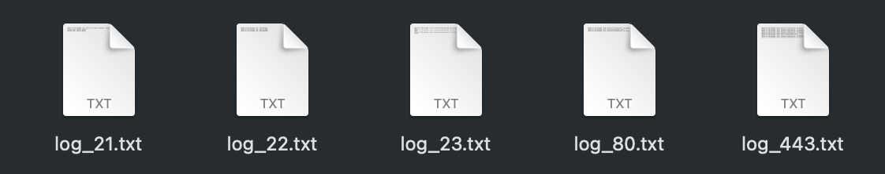
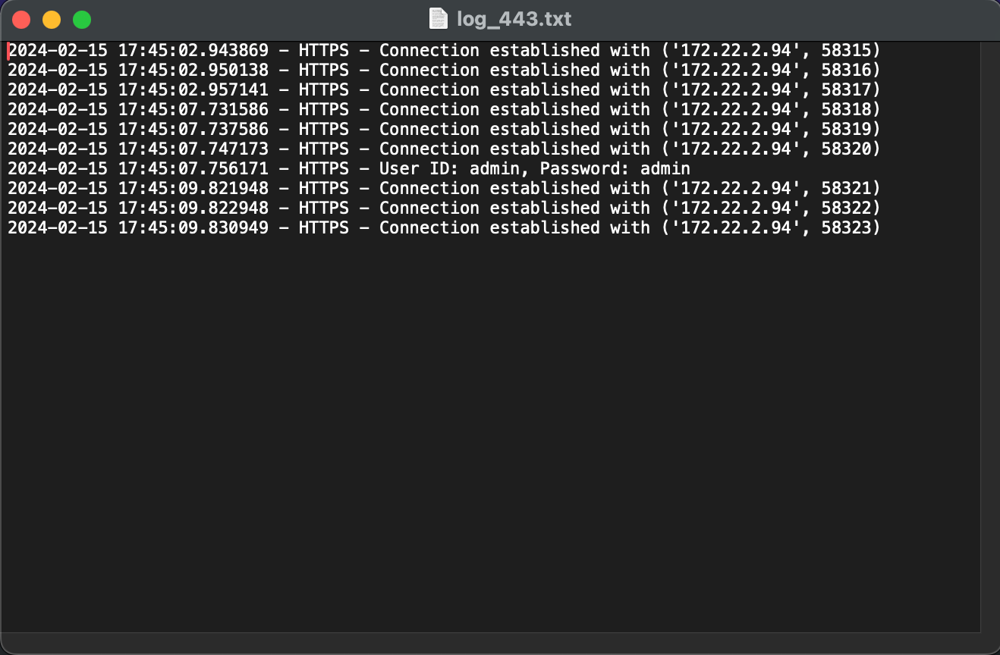

# Multi-Port Honeypot

This project is a multi-port honeypot designed to simulate various services like SSH, Telnet, HTTP, HTTPS, and FTP, to attract and analyze malicious activities from potential attackers. It simulates legitimate services on ports 22 (SSH), 23 (Telnet), 80 (HTTP), 443 (HTTPS), and 21 (FTP) to capture attacker activity and credentials.

This honeypot project was developed as a part of an internship program at Exide Industries Pvt. Ltd., Kolkata. Under the mentorship of experienced professionals, the project aimed to enhance understanding and practical skills in cybersecurity and network defense strategies.


## Features

Simulates multiple services: Mimics SSH, Telnet, HTTP, HTTPS, and FTP protocols to lure attackers.

- Logs attacker activity: Records detailed logs of connection attempts, usernames, passwords, and commands executed.

- Supports basic authentication: Implements basic username/password authentication for HTTP and FTP services.

- Multi-threaded: Handles multiple concurrent connections efficiently using threads.

Code Analysis:
Here's a breakdown of the key components:

Server classes:

- SSH_Server: Handles SSH connections, logs username/password attempts.
- Telnet_Server: Handles Telnet connections, logs received commands.
- Http_Server: Handles HTTP connections, logs basic authentication attempts.
- Https_Server: Handles HTTPS connections, logs basic authentication attempts with SSL encryption.
- Ftp_Server: Handles FTP connections, simulates a directory listing, logs failed login attempts.

Helper functions:
- write_to_log: Writes logs to separate files for each port.
- handle_ssh_connection: Creates a SSH_Server instance and starts the SSH server.
- handle_connection: Handles connections on other ports (not implemented in the provided code).
- Main function:
    Starts servers on ports 22, 23, 80, 443, and 21 using multiprocessing.
    Binds each server to a socket and listens for connections.
    Spawns threads to handle individual connections using the appropriate handler   function.


## Installation

Requirements:

- OpenSSL
```bash
Check https://www.openssl.org/ for instructions on installing OpenSSL
```

Custom Certifcate files:

To generate a custom certificate using OpenSSL, you can follow these steps:

- Create a Private Key: Generate a private key using OpenSSL.
- Create a Certificate Signing Request (CSR): Generate a CSR using the private key.
- Create a Self-Signed Certificate: Use the private key and CSR to create a        self-signed certificate.

Here's the code to achieve this:

```bash
# Generate a private key (Replace `private.key` with your desired filename)

openssl genpkey -algorithm RSA -out private.key -aes256
```

```bash
# Generate a CSR (Replace `custom.csr` with your desired filename)

openssl req -new -key private.key -out custom.csr
```

```bash
# Generate a self-signed certificate valid for 365 days (Replace `custom.crt` with your desired filename),

openssl x509 -req -days 365 -in custom.csr -signkey private.key -out custom.crt
```

Python 3
Libraries: 
- socket 
- threading
- paramiko
- base64
- ssl
- multiprocessing
    
## Deployment

Clone the repository using,
```bash
pip install - r requirements.txt
```

To install paramiko,
```bash
pip install - r requirements.txt
```
Run using,
```bash
python main.py
```


## Screenshots

To illustrate the logging functionality,






## Authors

- [@dev-datta](https://github.com/dev-datta)
## License

MIT License

Copyright (c) [2024] [ [@dev-datta](https://github.com/dev-datta)]

Permission is hereby granted, free of charge, to any person obtaining a copy
of this software and associated documentation files (the "Software"), to deal
in the Software without restriction, including without limitation the rights
to use, copy, modify, merge, publish, distribute, sublicense, and/or sell
copies of the Software, and to permit persons to whom the Software is
furnished to do so, subject to the following conditions:

The above copyright notice and this permission notice shall be included in all
copies or substantial portions of the Software.

THE SOFTWARE IS PROVIDED "AS IS", WITHOUT WARRANTY OF ANY KIND, EXPRESS OR
IMPLIED, INCLUDING BUT NOT LIMITED TO THE WARRANTIES OF MERCHANTABILITY,
FITNESS FOR A PARTICULAR PURPOSE AND NONINFRINGEMENT. IN NO EVENT SHALL THE
AUTHORS OR COPYRIGHT HOLDERS BE LIABLE FOR ANY CLAIM, DAMAGES OR OTHER
LIABILITY, WHETHER IN AN ACTION OF CONTRACT, TORT OR OTHERWISE, ARISING FROM,
OUT OF OR IN CONNECTION WITH THE SOFTWARE OR THE USE OR OTHER DEALINGS IN THE
SOFTWARE.

